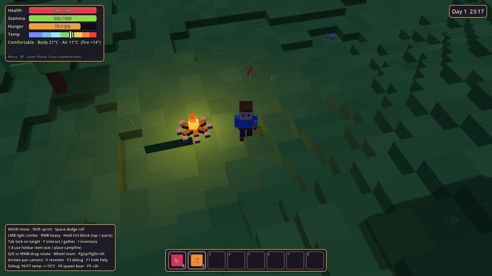

# Shardlands (working title)

A stylized, blocky low-poly **open-world survival RPG** built with **Godot 4.4**.
Top-down/isometric tactical camera, real-time manual combat, deterministic procedural
world streamed in chunks, survival systems (health, hunger, temperature), and a long-term
roadmap toward classes, skills, crafting, dungeons, settlements, building and a massive world.

> Status: **Phase 1 — playable prototype.** See [`docs/TODO.md`](docs/TODO.md) for the
> honest status of every system and [`docs/CHANGELOG.md`](docs/CHANGELOG.md) for history.


| Boar charge telegraph | Night & campfire |
|---|---|
|  |  |

## Requirements

- **Godot 4.4.x** (standard build, not .NET). Download: <https://godotengine.org/download>
- A GPU with Vulkan support for the default **Forward+** renderer.
  (The Compatibility/OpenGL renderer also runs, but colours look noticeably brighter there.)

## Run the game

**Editor:** open Godot → *Import* → select this folder's `project.godot` → press **F5**.

**Command line:**

```bash
godot --path .                       # play with the default seed
godot --path . -- --seed=12345       # play a specific world seed (numbers or any text)
```

The first launch shows a short "Generating world…" screen while the chunks around the
spawn point are built; then you are dropped into the Verdant Meadows.

## Controls

| Action | Key |
|---|---|
| Move (camera-relative) | W A S D |
| Sprint | Shift (costs stamina, more hunger) |
| Dodge roll (i-frames, rolls through enemies) | Space |
| Light attack (3-hit combo) | Left mouse |
| Heavy attack | Right mouse |
| Block (hold) / **Parry** (block right before a hit) | Ctrl |
| Aim | Mouse (your character faces the cursor) |
| Lock-on / cycle targets | Tab |
| Interact / gather / cook / pick up | F |
| Inventory | I |
| Use hotbar item (eat, place campfire) | 1 – 8 |
| Rotate camera | Q / E, or hold middle mouse and drag |
| Tilt camera | Page Up / Page Down, or middle-mouse drag vertically |
| Zoom | Mouse wheel |
| Pan camera freely / recenter | Arrow keys / V |
| Pause | Esc |
| Respawn after death | R |
| Help overlay / debug overlay | F1 / F3 |
| **Debug:** air temperature −10 / +10 °C | F6 / F7 |
| **Debug:** spawn a Thornback Boar in front of you | F8 |
| **Debug:** skip 2 hours | F9 |

## Things to try (manual test script)

1. **Camera** – rotate (Q/E), tilt (PgUp/PgDn), zoom (wheel), pan (arrows), recenter (V).
   Trees between the camera and you dither out so they never hide the action.
2. **Terrain streaming** – press F3, sprint in one direction and watch chunk counts: LOD0
   (collision + props) near you, LOD1/LOD2 further away; chunks behind you unload.
3. **Gathering** – walk to berry bushes / fallen sticks / loose stones and press F.
4. **Harvesting** – hit trees and boulders (LMB) to get wood / stone / flint. Walk away
   ~200 m and come back: felled trees stay felled (only world *changes* are stored).
5. **Combat** – find a Thornback Boar (or press F8). It telegraphs a charge with a red glow
   and ground scraping: dodge sideways (Space) or parry it (tap Ctrl right before impact).
   After a charge it pants and is **Exposed** (+50 % damage). Hitting it from behind is a
   **Backstab** (+50 %). Make it charge into a tree and it gets **Dazed**. Loot flies to you.
6. **Survival** – eat (1-8 or right-click in inventory). Hunger drains faster while
   sprinting and in the cold; at 0 you starve slowly.
7. **Temperature** – nights and hills are colder. Press F6 a few times to simulate a
   freezing place: debuffs appear under the temperature bar (slower, weaker, hungrier),
   but **temperature never damages you**. Place a campfire (hotbar key) to warm up, then
   press F on it to cook raw meat. Cooked meat also gives a temporary warmth buff.
8. **Death** – die to boars or starvation, then press R to respawn.

## Run the automated tests

```bash
tools/run_tests.sh            # or: tools/run_tests.sh /path/to/godot
```

or directly: `godot --headless --path . res://tests/test_runner.tscn` (exit code 0 = pass).

The suite (111 checks) covers deterministic generation, chunk meshes/LOD/collision,
inventory rules, hunger, temperature (never damages), world-state persistence, and an
**integration test that boots the real game** and plays it with simulated input:
movement, eating, combat vs. the boar, block/parry/i-frames, loot, tree harvesting,
gathering, campfire warmth & cooking, cold debuffs, streaming after teleport,
death and respawn.

Visual check (renders screenshots, needs a display or `xvfb-run`):

```bash
godot --path . res://tests/screenshot_runner.tscn -- --out=/tmp/shots
```

## Project layout

```
project.godot            Engine config, autoloads, physics layer names
scenes/                  Scenes (.tscn): main world, player, enemies, pickups, campfire
src/
  autoload/              Global singletons: InputSetup, Events (signal bus), GameState, ItemDB
  core/                  Shared utilities: hashing, pooling, block-mesh builder, materials, layers
  components/            Reusable node components: Health, Stamina, Hunger, Temperature, StatBlock
  combat/                AttackData resource, melee hit queries
  camera/                Tactical camera rig
  player/                Player controller, combat, blocky humanoid model
  enemies/               Enemy base class, Thornback Boar AI + model, enemy/loot data
  world/                 Terrain generator, chunks & streaming, biomes, props, spawner, day/night
  inventory/             ItemData resource, Inventory
  ui/                    HUD, theme, slots, temperature gauge
data/                    Data-driven content (.tres): items, attacks, enemies, props, biomes
tests/                   Automated test suite + screenshot runner
docs/                    TODO, CHANGELOG, architecture notes
tools/                   Helper scripts
```

See [`docs/ARCHITECTURE.md`](docs/ARCHITECTURE.md) for how the systems fit together and how
to add new items, props, enemies and biomes without touching engine code.
